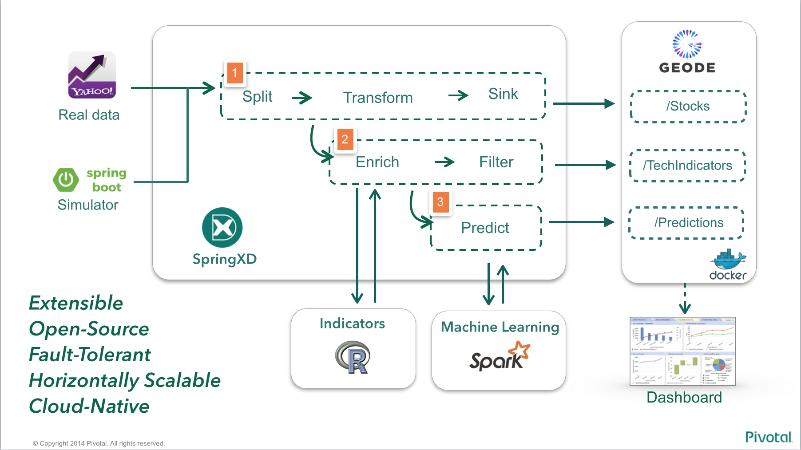
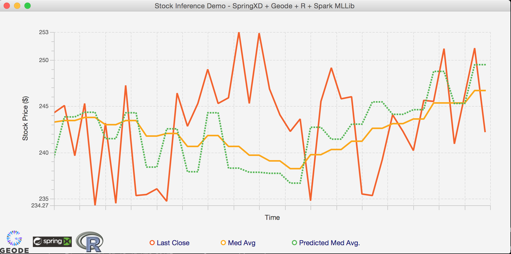

# Stock Prediction with Machine Learning 




## Summary

Stock Inference engine using Spring XD, Apache Geode / GemFire and Spark ML Lib.

## Requirements

* [Apache Geode (Incubating)](http://geode.incubator.apache.org/) or [Pivotal GemFire](http://pivotal.io/big-data/pivotal-gemfire)
* [Spring XD 1.2+](http://projects.spring.io/spring-xd/)
* [Apache Spark 1.3.1](http://spark.apache.org/downloads.html)
* [Apache Zeppelin (Incubating)](http://zeppelin.incubator.apache.org/)
* 8GB+ RAM (recommended)
* Linux or OSX (Windows should be OK but instructions assume *nix shell)

* **Pre-packaged VM for download**: http://bit.ly/1F7uBxT

PS: If you are were given a pre-packaged Vagrant VM for this lab you'll only need:

* [VirtualBox 4.3+ or 5.0](https://www.virtualbox.org/wiki/Downloads)
* [Vagrant](https://www.vagrantup.com/downloads.html)

If you prefer to create a demo VM yourself, the instructions are [here](VM.md)

## First steps with each product

If you're not familiar with Geode/GemFire, Spring XD, Spark ML and Apache Zeppelin, please first follow the product specific labs below:

* [First steps with Apache Geode](Geode.md)
* [First steps with SpringXD Lab](SpringXD.md)
* [First steps with Spark ML](SparkML.md)
* [First steps with Apache Zeppelin](Zeppelin.md)


### Starting the demo environment

If you have received a pre-built Virtual Machine, start the VM and access its console using ssh as below:

```
$ vagrant up

Bringing machine 'default' up with 'virtualbox' provider...
==> default: Box 'package.box' could not be found. Attempting to find and install...
    default: Box Provider: virtualbox
    default: Box Version: >= 0
==> default: Adding box 'package.box' (v0) for provider: virtualbox
    default: Downloading: file:///Users/fmelo/qcon/package.box
==> default: Successfully added box 'package.box' (v0) for 'virtualbox'!
(...)
    default: Running: inline script
==> default: stdin: is not a tty
==> default: QCon Rio 2015 - Pivotal Lab

$ vagrant ssh
Welcome to Ubuntu 15.04 (GNU/Linux 3.19.0-23-generic x86_64)

 * Documentation:  https://help.ubuntu.com/

  System information as of Mon Aug 24 01:13:06 UTC 2015

  System load:  0.0                Processes:           96
  Usage of /:   17.6% of 38.81GB   Users logged in:     0
  Memory usage: 2%                 IP address for eth0: 10.0.2.15
  Swap usage:   0%                 IP address for eth1: 192.168.56.10

  Graph this data and manage this system at:
    https://landscape.canonical.com/

  Get cloud support with Ubuntu Advantage Cloud Guest:
    http://www.ubuntu.com/business/services/cloud

47 packages can be updated.
27 updates are security updates.


Last login: Sun Aug 23 23:16:30 2015 from 10.0.2.2
_____________________________________________________________________________

Lab variables:
GEODE_HOME=/home/vagrant/incubator-geode/gemfire-assembly/build/install/apache-geode
SPRINGXD_HOME=/home/vagrant/spring-xd-2.0.0.BUILD-SNAPSHOT
ZEPPELIN_HOME=/home/vagrant/incubator-zeppelin
SPARK_HOME=/home/vagrant/spark-1.3.1-bin-hadoop2.6
PROJECT=/home/vagrant/project/StockInference-Spark

_____________________________________________________________________________

[vagrant@stocks-vm, load: 0.00] (Mon Aug 24 - 01:13:10)
~ $
```


If you're not using the pre-built VM, just create host entries pointing to where your Geode/GemFire ("geode-server") and Spring XD ("xd-server") servers will be available. 
For example, configuring the demo to run all servers at my localhost:
```
$ more /etc/hosts
##
# Host Database
#
# localhost is used to configure the loopback interface
# when the system is booting.  Do not change this entry.
##
127.0.0.1       localhost geode-server xd-server
255.255.255.255 broadcasthost
::1             localhost
```

you'll also need to export the GEODE_HOME variable, pointing to *your* Apache Geode installation 

```
$ export GEODE_HOME=/home/pivotal/apache-geode

```
To verify if you have the right directory, you should be able to launch gfsh by typing  ``$GEODE_HOME/bin/gfsh``

```
$ $GEODE_HOME/bin/gfsh
    _________________________     __
   / _____/ ______/ ______/ /____/ /
  / /  __/ /___  /_____  / _____  /
 / /__/ / ____/  _____/ / /    / /
/______/_/      /______/_/    /_/    v1.0.0-incubating-SNAPSHOT

Monitor and Manage GemFire
gfsh>exit
Exiting...
$
```


### Creating the Geode / GemFire regions 

The demo uses three different regions for storing data:
* /Stocks - Stores raw stock trading data, as acquired from [Yahoo Finance YQL](finance.yahoo.com) or using the simulator (which randomly replays data previously ingested from the same Yahoo Finance YQL)
* /TechIndicators - Stores technical indicators, which will be used as inputs / features to the Machine Learning model. The indicators are calculated by the [R script](streaming/tech_indicators.R), which is involked by Spring XD.
* /Predictions - Stores the predicted data, as it gets calculated by the [Spark MLLib model](StockInference/src/main/scala/io/pivotal/demo/StockInferenceDemo.scala).

To create the regions, execute the script `startGeode.sh` under the `data` folder of this project root path as below:

```
$ cd project/StockInference-Spark/data
$ ./startGeode.sh

1. Executing - start locator --name=locator1 --J=-Dgemfire.http-service-port=7575

............................................
Locator in /home/vagrant/project/StockInference-Spark/data/locator1 on 192.168.56.10[10334] as locator1 is currently online.
Process ID: 4374
Uptime: 23 seconds
GemFire Version: 1.0.0-incubating-SNAPSHOT
Java Version: 1.8.0_51
Log File: /home/vagrant/project/StockInference-Spark/data/locator1/locator1.log
JVM Arguments: -Dgemfire.enable-cluster-configuration=true -Dgemfire.load-cluster-configuration-from-dir=false -Dgemfire.http-service-port=7575 -Dgemfire.launcher.registerSignalHandlers=true -Djava.awt.headless=true -Dsun.rmi.dgc.server.gcInterval=9223372036854775806
Class-Path: /home/vagrant/incubator-geode/gemfire-assembly/build/install/apache-geode/lib/gemfire-core-1.0.0-incubating-SNAPSHOT.jar:/home/vagrant/incubator-geode/gemfire-assembly/build/install/apache-geode/lib/gemfire-core-dependencies.jar

Successfully connected to: [host=192.168.56.10, port=1099]

Cluster configuration service is up and running.

2. Executing - start server --name=server1 --J=-Dgemfire.start-dev-rest-api=true --J=-Dgemfire.http-service-port=8888

..............
Server in /home/vagrant/project/StockInference-Spark/data/server1 on 192.168.56.10[40404] as server1 is currently online.
Process ID: 4546
Uptime: 7 seconds
GemFire Version: 1.0.0-incubating-SNAPSHOT
Java Version: 1.8.0_51
Log File: /home/vagrant/project/StockInference-Spark/data/server1/server1.log
JVM Arguments: -Dgemfire.default.locators=192.168.56.10[10334] -Dgemfire.use-cluster-configuration=true -Dgemfire.start-dev-rest-api=true -Dgemfire.http-service-port=8888 -XX:OnOutOfMemoryError=kill -KILL %p -Dgemfire.launcher.registerSignalHandlers=true -Djava.awt.headless=true -Dsun.rmi.dgc.server.gcInterval=9223372036854775806
Class-Path: /home/vagrant/incubator-geode/gemfire-assembly/build/install/apache-geode/lib/gemfire-core-1.0.0-incubating-SNAPSHOT.jar:/home/vagrant/incubator-geode/gemfire-assembly/build/install/apache-geode/lib/gemfire-core-dependencies.jar

3. Executing - create region --name=/Stocks --type=PARTITION

Member  | Status
------- | -------------------------------------
server1 | Region "/Stocks" created on "server1"

4. Executing - create region --name=/TechIndicators --type=PARTITION

Member  | Status
------- | ---------------------------------------------
server1 | Region "/TechIndicators" created on "server1"

5. Executing - create region --name=/Predictions --type=PARTITION

Member  | Status
------- | ------------------------------------------
server1 | Region "/Predictions" created on "server1"

6. Executing - import data --region=/Stocks --file=../Stocks.gfd --member=server1

Data imported from file : /home/vagrant/project/StockInference-Spark/data/Stocks.gfd on host : 192.168.56.10 to region : /Stocks

7. Executing - import data --region=/TechIndicators --file=../TechIndicators.gfd --member=server1

Data imported from file : /home/vagrant/project/StockInference-Spark/data/TechIndicators.gfd on host : 192.168.56.10 to region : /TechIndicators

8. Executing - describe region --name=/Stocks

..........................................................
Name            : Stocks
Data Policy     : partition
Hosting Members : server1

Non-Default Attributes Shared By Hosting Members

 Type  |    Name     | Value
------ | ----------- | ---------
Region | size        | 41540
       | data-policy | PARTITION


9. Executing - describe region --name=/TechIndicators

..........................................................
Name            : TechIndicators
Data Policy     : partition
Hosting Members : server1

Non-Default Attributes Shared By Hosting Members

 Type  |    Name     | Value
------ | ----------- | ---------
Region | size        | 36486
       | data-policy | PARTITION


10. Executing - describe region --name=/Predictions

..........................................................
Name            : Predictions
Data Policy     : partition
Hosting Members : server1

Non-Default Attributes Shared By Hosting Members

 Type  |    Name     | Value
------ | ----------- | ---------
Region | size        | 0
       | data-policy | PARTITION
```
As you can verify, the script not only created the regions but also imported some data we had captured earlier, in order to train our model. We'll keep re-training it later as we ingest data.

Next, we should deploy the Geode/GemFire functions for the Spark Connector:

```
~/project/StockInference-Spark/data $ ./deployFunctionVM.sh

(1) Executing - connect

Connecting to Locator at [host=localhost, port=10334] ..
Connecting to Manager at [host=192.168.56.10, port=1099] ..
Successfully connected to: [host=192.168.56.10, port=1099]


(2) Executing - deploy --jar=/home/vagrant/incubator-geode/gemfire-spark-connector/gemfire-functions/target/scala-2.10/gemfire-functions_2.10-0.5.0.jar

Member  |           Deployed JAR           | Deployed JAR Location
------- | -------------------------------- | ------------------------------------------------------------------------------------------------
server1 | gemfire-functions_2.10-0.5.0.jar | /home/vagrant/project/StockInference-Spark/data/server1/vf.gf#gemfire-functions_2.10-0.5.0.jar#1

```


### Training the Machine Learning model

Before executing the Machine Learning model on Spark, we need to train it with existing data.
For doing that, run the script below, which involkes the [scala class](StockInference/src/main/scala/io/pivotal/demo/StockInferenceDemo.scala) 

From the streaming folder, run ``train.sh`` . It will take a while for it to run.
```
~/project/StockInference-Spark $ cd streaming

~/project/StockInference-Spark/streaming $ ./train.sh
15/08/24 03:07:41 INFO SparkContext: Running Spark version 1.3.1
15/08/24 03:07:41 WARN Utils: Your hostname, stocks-vm resolves to a loopback address: 127.0.1.1; using 10.0.2.15 instead (on interface eth0)
(...)
15/08/24 03:09:33 INFO DAGScheduler: Stage 2012 (mean at StockInferenceDemo.scala:127) finished in 0.072 s
15/08/24 03:09:33 INFO DAGScheduler: Job 2012 finished: mean at StockInferenceDemo.scala:127, took 0.084467 s
training Mean Squared Error = 4.356799628392633E-4
[info 2015/08/24 03:09:33.493 UTC <Distributed system shutdown hook> tid=0x40] VM is exiting - shutting down distributed system

[info 2015/08/24 03:09:33.498 UTC <Distributed system shutdown hook> tid=0x40] GemFireCache[id = 1756587746; isClosing = true; isShutDownAll = false; created = Mon Aug 24 03:07:48 UTC 2015; server = false; copyOnRead = false; lockLease = 120; lockTimeout = 60]: Now closing.

[info 2015/08/24 03:09:33.555 UTC <Distributed system shutdown hook> tid=0x40] Destroying connection pool DEFAULT
```


### Creating the Spring XD streams

Now we'll create the streams in SpringXD that orchestrate all the data flow.

Let's first start Spring XD. From the ``streaming`` directory, run the script `startSpringXD.sh`. This will start the server in background, outputing the logs to the file ``nohup.out``

```
~/project/StockInference-Spark/streaming $ ./startSpringXD.sh
Starting...
nohup: appending output to ‘nohup.out’
```

Next, take a look at the file ``stream-create.xd``, containing the streams we'll create on Spring XD. Remember the  [architecture image](StockInference-arch.png)

```
~/project/StockInference-Spark/streaming $ more stream-create.xd
admin config server http://localhost:9393

stream create process_sink --definition "queue:stocks >  transform --script='file:./transform.groovy' | object-to-json | gemfire-json-server --useLocator=true --host=localhost --port
=10334 --regionName=Stocks --keyExpression=payload.getField('entryTimestamp')" --deploy

stream create yahoo_finance_source --definition "trigger --cron='* * 7-13 * * MON-FRI' | http-client --url='''https://query.yahooapis.com/v1/public/yql?q=select Symbol, LastTradeDate
, LastTradeTime, LastTradePriceOnly, DaysHigh, DaysLow, Open from yahoo.finance.quotes where symbol in (\"TSLA\")&format=json&env=store://datatables.org/alltableswithkeys''' --httpMe
thod=GET | splitter --expression=#jsonPath(payload,'$.query.results.quote')  > queue:stocks" --deploy

stream create http_source --definition "http --port=9000 | splitter --expression=#jsonPath(payload,'$') > queue:stocks" --deploy

stream create --name r_process --definition "tap:stream:process_sink.transform > r-parsing: object-to-json | shell --command='Rscript ./tech_indicators.R' | formatting: splitter --ex
pression=#jsonPath(payload,'$') | filter --expression=#jsonPath(payload,'$.rsi').indexOf('NaN')==-1 | object-to-json | gemfire-json-server --useLocator=true --host=locator --port=103
34 --regionName=TechIndicators --keyExpression=payload.getField('entryTimestamp')" --deploy

stream create --name prediction --definition "tap:stream:r_process.object-to-json > shell --command='../evaluate.sh' | gemfire-json-server --regionName=Predictions --host=localhost -
-port=10334 --useLocator=true --keyExpression=payload.getField('entryTimestamp')" --deploy

# stream create --name training --definition "trigger --fixedDelay=300 | shell --command='../train.sh'" --deploy
```

Please note the ``yahoo_finance_source`` stream has a cron based on PDT timezone (7-13 MON-FRI = normal Wall Street operating times). If your environment has another timezone set, you'll need to adjust it accordingly.

Execute the script ``stream-create.sh`` to deploy all streams to Spring XD:

```
~/project/StockInference-Spark/streaming $ ./stream-create.sh
Aug 24, 2015 3:19:48 AM org.springframework.shell.core.AbstractShell handleExecutionResult
INFO: Successfully targeted http://localhost:9393
Aug 24, 2015 3:19:53 AM org.springframework.shell.core.AbstractShell handleExecutionResult
INFO: Created and deployed new stream 'process_sink'
Aug 24, 2015 3:19:54 AM org.springframework.shell.core.AbstractShell handleExecutionResult
INFO: Created and deployed new stream 'yahoo_finance_source'
Aug 24, 2015 3:19:55 AM org.springframework.shell.core.AbstractShell handleExecutionResult
INFO: Created and deployed new stream 'http_source'
Aug 24, 2015 3:20:05 AM org.springframework.shell.core.AbstractShell handleExecutionResult
INFO: Created and deployed new stream 'r_process'
Aug 24, 2015 3:20:08 AM org.springframework.shell.core.AbstractShell handleExecutionResult
INFO: Created and deployed new stream 'prediction'
```

At this point, Spring XD is already querying Yahoo Finance for the latest quotes(at the normal market hours), and also listening for possible quotes at port 9000. 

### Using the Simulator

When you're not on US stock market open hours, we can use the simulator to randomly replay some of the old quotes stored on Geode / GemFire. As the order is random, we can expect a much higher volatility.

Start the simulator from the ``FinanceStreamSimulator`` folder:

```
~/project/StockInference-Spark/FinanceStreamSimulator $ ./startSimulator.sh
:compileJava UP-TO-DATE
:processResources UP-TO-DATE
:classes UP-TO-DATE
:findMainClass
:run
  /$$$$$$$$ /$$            /$$$$$$   /$$                      /$$$$$$  /$$                         /$$             /$$
| $$_____/|__/           /$$__  $$ | $$                     /$$__  $$|__/                        | $$            | $$
| $$       /$$ /$$$$$$$ | $$  \__//$$$$$$    /$$$$$$       | $$  \__/ /$$ /$$$$$$/$$$$  /$$   /$$| $$  /$$$$$$  /$$$$$$    /$$$$$$   /$$$$$$
| $$$$$   | $$| $$__  $$|  $$$$$$|_  $$_/   /$$__  $$      |  $$$$$$ | $$| $$_  $$_  $$| $$  | $$| $$ |____  $$|_  $$_/   /$$__  $$ /$$__  $$
| $$__/   | $$| $$  \ $$ \____  $$ | $$    | $$  \__/       \____  $$| $$| $$ \ $$ \ $$| $$  | $$| $$  /$$$$$$$  | $$    | $$  \ $$| $$  \__/
| $$      | $$| $$  | $$ /$$  \ $$ | $$ /$$| $$             /$$  \ $$| $$| $$ | $$ | $$| $$  | $$| $$ /$$__  $$  | $$ /$$| $$  | $$| $$
| $$      | $$| $$  | $$|  $$$$$$/ |  $$$$/| $$            |  $$$$$$/| $$| $$ | $$ | $$|  $$$$$$/| $$|  $$$$$$$  |  $$$$/|  $$$$$$/| $$
|__/      |__/|__/  |__/ \______/   \___/  |__/             \______/ |__/|__/ |__/ |__/ \______/ |__/ \_______/   \___/   \______/ |__/


Finance Stream Simulator

Usage:  java -jar FinanceStreamSimulator.jar [--serverUrl=<URL>] [--numberOfMessages=<messages>] [--basePrice=<price>] [--scale=<scale>]


2015-08-24 04:16:38.055  INFO 9954 --- [           main] io.pivotal.demo.SimulatorApp             : Starting SimulatorApp on stocks-vm with PID 9954 (/home/vagrant/project/StockInference-Spark/FinanceStreamSimulator/build/classes/main started by vagrant in /home/vagrant/project/StockInference-Spark/FinanceStreamSimulator)
2015-08-24 04:16:38.096  INFO 9954 --- [           main] s.c.a.AnnotationConfigApplicationContext : Refreshing org.springframework.context.annotation.AnnotationConfigApplicationContext@51e2adc7: startup date [Mon Aug 24 04:16:38 UTC 2015]; root of context hierarchy
2015-08-24 04:16:38.847  INFO 9954 --- [           main] o.s.j.e.a.AnnotationMBeanExporter        : Registering beans for JMX exposure on startup
2015-08-24 04:16:38.852  INFO 9954 --- [           main] io.pivotal.demo.ReplaySimulator          : --------------------------------------
2015-08-24 04:16:38.853  INFO 9954 --- [           main] io.pivotal.demo.ReplaySimulator          : >>> Geode rest endpoint: http://localhost:8888
2015-08-24 04:16:38.853  INFO 9954 --- [           main] io.pivotal.demo.ReplaySimulator          : >>> Endpoint URL: http://localhost:9000
2015-08-24 04:16:38.853  INFO 9954 --- [           main] io.pivotal.demo.ReplaySimulator          : >>> Number of messages: 500
2015-08-24 04:16:38.854  INFO 9954 --- [           main] io.pivotal.demo.ReplaySimulator          : >>> Symbol: TSLA
2015-08-24 04:16:38.854  INFO 9954 --- [           main] io.pivotal.demo.ReplaySimulator          : --------------------------------------
2015-08-24 04:16:39.240  INFO 9954 --- [           main] io.pivotal.demo.ReplaySimulator          : >>> Posting 500 messages 2015-08-24 04:21:20.768  INFO 10187 --- [           main] io.pivotal.demo.ReplaySimulator          : done
2015-08-24 04:21:20.769  INFO 10187 --- [           main] io.pivotal.demo.SimulatorApp             : Started SimulatorApp in 154.355 seconds (JVM running for 154.685)
2015-08-24 04:21:20.772  INFO 10187 --- [       Thread-1] s.c.a.AnnotationConfigApplicationContext : Closing org.springframework.context.annotation.AnnotationConfigApplicationContext@51e2adc7: startup date [Mon Aug 24 04:18:46 UTC 2015]; root of context hierarchy
2015-08-24 04:21:20.773  INFO 10187 --- [       Thread-1] o.s.j.e.a.AnnotationMBeanExporter        : Unregistering JMX-exposed beans on shutdown

BUILD SUCCESSFUL

Total time: 2 mins 38.003 secs

```

### Verifying the calculated predictions 

Use GFSH to connect to Geode/GemFire and verify the Predictions region:

```
$ gfsh
    _________________________     __
   / _____/ ______/ ______/ /____/ /
  / /  __/ /___  /_____  / _____  /
 / /__/ / ____/  _____/ / /    / /
/______/_/      /______/_/    /_/    v1.0.0-incubating-SNAPSHOT

Monitor and Manage GemFire
gfsh> connect --locator=192.168.56.10[10334]
Connecting to Locator at [host=192.168.56.10, port=10334] ..
Connecting to Manager at [host=192.168.56.10, port=1099] ..
Successfully connected to: [host=192.168.56.10, port=1099]

gfsh>describe region --name=/Predictions
..........................................................
Name            : Predictions
Data Policy     : partition
Hosting Members : server1

Non-Default Attributes Shared By Hosting Members

 Type  |    Name     | Value
------ | ----------- | ---------
Region | size        | 500
       | data-policy | PARTITION

```

Now check some of the data:

```
gfsh>query --query="select entryTimestamp, ema, predicted from /Predictions order by entryTimestamp desc"

Result     : true
startCount : 0
endCount   : 20
Rows       : 548

entryTimestamp |       ema        | predicted
-------------- | ---------------- | ------------------
13353015247329 | 243.655200392179 | 244.36126012453593
13352705066802 | 243.304022701552 | 244.4679070450193
13352402037135 | 242.724916646386 | 243.45581253816388
13352098169940 | 242.36154257993  | 243.70099081921597
13351795573541 | 241.695218711637 | 238.62424186981085
13351492002111 | 243.225267310611 | 244.00046225381527
13351189015085 | 242.839771151012 | 242.8768374516088
13350884494287 | 242.82194251399  | 240.2610870520309
13350573308646 | 244.09792973193  | 246.75466201448913
13350268197871 | 242.775025233505 | 240.11608047958853
13349964892135 | 244.100586370887 | 244.7387182131781
13349658440285 | 243.782938889622 | 243.34998938877558
13349354287691 | 243.999147524282 | 243.42056117407438
13349043851852 | 244.287846987753 | 245.56848677338888
13348734159759 | 243.650035229633 | 243.8471030722387
13348413390251 | 243.552265288641 | 244.84555218518653
13348104692176 | 242.908324243737 | 244.77470961584862
13347800579225 | 241.979062973214 | 238.83273528756686
13347496878110 | 243.547743641872 | 243.66095598690484
13347193662872 | 243.491708904    | 242.94782444029957
13346886510828 | 243.763199762867 | 243.0980329260479
(...)
```
You can check how accurate the predicted value is by comparing the __ema__ and __predicted__ columns

### EXTRA: Checking the predictions in real-time using the GUI

ps: If you're using the provided VM, you'll need to clone this repository in your local environment to use the Java Rich UI.

From the directory ``JavaFXClient``, edit the file ``src/main/resources/client.xml`` to point the GemFire/Geode native client to where you're running the servers.
If you're using the provided VM, this should be the VM IP (192.168.56.10).. otherwise, if you're running it local just use localhost.


```
JavaFXClient $ more src/main/resources/client.xml
<?xml version="1.0"?>
<!DOCTYPE client-cache PUBLIC
        "-//GemStone Systems, Inc.//GemFire Declarative Caching 8.0//EN"
        "http://www.gemstone.com/dtd/cache8_0.dtd">

<client-cache>
    <pool name="client" subscription-enabled="true">
        <locator host="192.168.56.10" port="10334" /> <!-- CHANGE THE IP ON THIS LINE TO POINT TO GEODE/GEMFIRE -->
    </pool>

    <region name="Stocks">
        <region-attributes refid="PROXY">
            <cache-listener>
                <class-name>io.pivotal.demo.StockListener</class-name>
            </cache-listener>
        </region-attributes>
    </region>

    <region name="Predictions">
        <region-attributes refid="PROXY">
            <cache-listener>
                <class-name>io.pivotal.demo.PredictionListener</class-name>
            </cache-listener>
        </region-attributes>
    </region>
</client-cache>

```
Start the GUI:

```
JavaFXClient $ ./gradlew run
:compileJava UP-TO-DATE
:processResources UP-TO-DATE
:classes UP-TO-DATE
:runfx
(...)

```
This should open the Java based UI. Now run the simulator again, and watch the predicted and real values being plotted in real-time!


